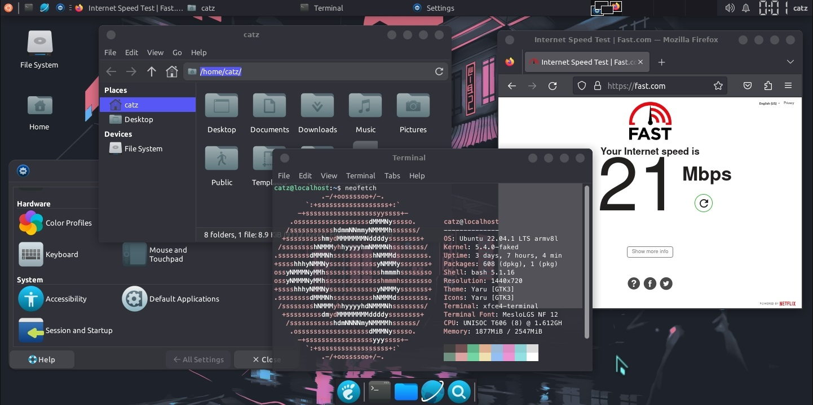

<p align="center">

</p>
<p align="center">


</p>
<p align="center">


</p>
<p align="center"><b>Run Ubuntu GUI on your termux with much features.</b></p>

> **⚠️ Modded Version Notice**
> This is a modded version of [modded-ubuntu](https://github.com/modded-ubuntu/modded-ubuntu/tree/master).
> All credits and thanks go to the original **modded-ubuntu** project and its contributors.

### Features

- Audio output support (fixed for Termux/proot environments)
- Lightweight installation (requires at least 4 GB of available storage)
- Choice of two browsers: Chromium and Mozilla Firefox
- Bengali font support (fonts-beng / fonts-beng-extra)
- Media players: VLC and MPV
- Visual Studio Code (note: may exhibit instability on ARM devices)
- Sublime Text Editor (supported on arm64/aarch64 only)
- Beginner-friendly installation process
- Pre-configured desktop themes and wallpapers
- Termux-X11 support for low-latency native display

### Installation

**Step 1 — Install Termux**

Download and install the [Termux](https://termux.com) application from [F-Droid](https://f-droid.org/repo/com.termux_118.apk).

**Step 2 — Clone the repository and run the setup script**

  - `yes | pkg up`
  - `pkg install git wget -y`
  - `git clone --depth=1 https://github.com/Senestro88/senestro-ubuntu.git`
  - `cd senestro-ubuntu`
  - `bash install.sh`

**Step 3 — Create your Ubuntu user**

Restart Termux, then run the following commands:

   - `senestro-ubuntu`
   - `bash user.sh`

Enter a username when prompted. It must be lowercase with no spaces.

**Step 4 — Install the GUI**

Restart Termux again, then run:

   - `senestro-ubuntu`
   - `sudo bash gui.sh`

The Ubuntu image is now fully installed.

**Termux-X11 mode** (run in Termux):
  - Install the [Termux-X11 companion APK](https://github.com/termux/termux-x11/releases) on your device.
  - Open the Termux-X11 app first, then run `x11start-senestro-ubuntu` in Termux.
  - Run `x11stop-senestro-ubuntu` in Termux to stop the desktop.

### Quick Reference

| Command | Where | Description |
|---|---|---|
| `senestro-ubuntu` | Termux | Launch the Ubuntu CLI environment |
| `x11start-senestro-ubuntu` | Termux | Start the desktop via Termux-X11 |
| `x11stop-senestro-ubuntu` | Termux | Stop the Termux-X11 desktop session |
| `bash uninstall.sh` | Termux | Uninstall the Ubuntu environment |

#
### Click to see the [Changelog](./CHANGELOG.md)
Licensed under [Apache License](./LICENSE)
#

### Credits : 

```
This Tool Uses the ubuntu image provided by the termux package `proot-distro` 

Full Credit of the Ubuntu image goes to them .

Termux Proot Distro - https://github.com/termux/proot-distro
```

### Maintainers

- [**Mustakim Ahmed**](https://github.com/BDhackers009)
- [**Tahmid Rayat**](https://github.com/htr-tech)
- [**0xBaryonyx**](https://github.com/Mahfuz-THBD)


### If you like our work then dont forget to give a Star :)

